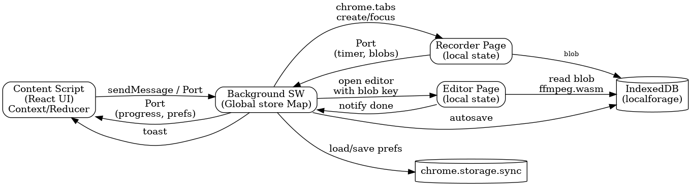

# Screenity Codebase Guide  

**Last updated:** 13 May 2025  
**Audience:** New contributors who want a mental model *and* a map of the most important files.

---

## 1. How Screenity is shipped

| Layer | Purpose | What to look at |
|-------|---------|-----------------|
| **Webpack build** | Turns each folder under `src/pages/**` into its own HTML + JS bundle. Extracts SCSS and copies assets declared in the manifest. | `webpack.config.js`, `utils/build.js` |
| **Manifest (MV3)** | Declares background **service‑worker**, a single **content‑script**, all HTML pages, permissions, and web‑accessible resources. | `src/manifest.json` |
| **Dist folder** | After `npm run build` you’ll see `background.bundle.js`, `contentScript.bundle.js`, `recorder.html`, `editor.html`, etc. The manifest points to those files. | *(generated in)* `dist/` |

---

## 2. High‑level runtime architecture

```
┌────────────────────────┐
│      Content‑Script     │  🖌️  Toolbar & overlays shown on top of the
│  (React app injected)   │  user’s tab. Sends commands to the background.
└──────────▲─────────────┘
           │ (chrome.runtime.*)
           ▼
┌────────────────────────┐
│  Background Service‑WK │  🧠  Keeps global state, owns permissions,
│                        │  spawns/controls extra tabs & off‑screen docs.
└───────▲───────┬────────┘
        │       │ opens
        │       ▼
        │  ┌──────────────┐
        │  │ Recorder tab │  🎥  Captures screen + mic → MediaRecorder
        │  └──────────────┘
        │       │ when stopped
        │       ▼
        │  ┌──────────────┐
        │  │  Editor tab  │  ✂️   Loads ffmpeg.wasm for trimming / export
        │  └──────────────┘
        ▼
 Updates (time, size) relayed back to content‑script so the toolbar stays live.
```

### Data‑store cheatsheet

| What | Where | Library |
|------|-------|---------|
| User settings (booleans, hotkeys, default export type…) | `chrome.storage.sync` | — |
| Large blobs during editing / autosave backups | IndexedDB | [`localforage`](https://github.com/localForage/localForage) |
| OAuth tokens & Drive file IDs | `chrome.storage.local` | — |

---

## 3. Folder map *and* folder roles

```text
screenity/
├── src/
│   ├── manifest.json
│   ├── assets/               # icons, SVG, fonts, Selfie‑Segmentation model
│   ├── pages/                # every sub‑folder = one “page” or script
│   │   ├── Background/       # service‑worker entry
│   │   ├── Content/          # injected React UI (see below)
│   │   ├── Recorder/         # tab/off‑screen document
│   │   ├── RecorderOffscreen/# MV3 hidden doc variant
│   │   ├── Editor/           # ffmpeg.wasm editor
│   │   ├── Camera/           # camera‑only page / PiP
│   │   └── …                 # Backup, Waveform, Permissions, …
│   └── _locales/             # i18n JSON
├── utils/                    # node‑side helpers (e.g. auto‑reload)
├── webpack.config.js
└── package.json
```

### 3.1 **Pages vs Content** — same concepts, different responsibilities

| Folder | Lives in Chrome as… | Runs **where** | Typical job | Example files |
|--------|--------------------|----------------|-------------|---------------|
| **`src/pages/*`** (top‑level) | Independent **pages** or **scripts** that Webpack turns into **separate bundles** (`background.bundle.js`, `recorder.html`, `camera.html`, etc.). | In their *own* context – service‑worker, extra tab, or hidden off‑screen document. | Heavy logic that shouldn’t block / break the website being recorded. | • `Background/index.js` – global brain<br>• `Recorder/Recorder.jsx` – captures screen<br>• `Camera/index.jsx` – webcam + blur |
| **`src/pages/Content/*`** | **React components** bundled into `contentScript.bundle.js` (the script injected into every tab). | **Inside the recorded tab itself**, overlaid on top of whatever page the user is visiting. | All visible UI: toolbar, countdown, drawing tools, draggable camera bubble. | • `toolbar/Toolbar.jsx`<br>• `region/RegionOverlay.jsx`<br>• `camera/CameraWrap.jsx` |

> **Rule of thumb** — *Pages* = independent apps doing the heavy lifting.    
> *Content* = lightweight overlay UI the user interacts with.

---

## 4. End‑to‑end flow

| # | Event | File(s) involved |
|---|-------|------------------|
| 1 | **Injection** – content‑script mounts `<Content />` | `Content/index.jsx` |
| 2 | User clicks **Record** → message to background | `Content/ContentState.jsx` |
| 3 | Background opens Chrome picker (`chooseDesktopMedia`) | `Background/index.js` |
| 4 | Background spawns **Recorder** tab `recorder.html?tabId=…` | `Background/modules/tabHelper.js` |
| 5 | Recorder merges streams and starts `MediaRecorder` | `Recorder/Recorder.jsx` |
| 6 | Progress Port back to background → forward to toolbar | `Recorder/modules/sendProgress.js` |
| 7 | **Stop** → blobs saved in IndexedDB, message `open-editor` | `Recorder.jsx` |
| 8 | Background opens / focuses **Editor** tab | `Background#index.js@openEditor` |
| 9 | Editor loads blob, spins ffmpeg.wasm, lets user trim/export | `Editor/Editor.jsx` |
| 10 | Success → cleanup blobs, content‑script shows toast | `Editor/modules/exportFlow.js` |

---

## 5. Messages & Ports

* **Short commands** use `chrome.runtime.sendMessage`.  
* **Streaming conversations** (progress updates) use a Port from `chrome.runtime.connect()`.

Message constants live in `utils/messages.js`.

---

## 6. Key modules to grok first

| Area | File(s) | Why it matters |
|------|---------|----------------|
| **Tab orchestration** | `Background/modules/tabHelper.js` | Ensures only one recorder/editor, focuses existing tabs. |
| **Recorder glue** | `Recorder/Recorder.jsx` | `getDisplayMedia` → `MediaRecorder` pipeline. |
| **Draw & region overlay** | `Content/region/*` | SVG overlay that supports zoom & drag. |
| **Toolbar** | `Content/toolbar/Toolbar.jsx` | Central UI, hotkeys, countdown. |
| **Drive upload** | `Background/modules/saveToDrive.js` | OAuth2 + resumable upload, retries. |
| **Editor export** | `Editor/modules/exportFlow.js` | ffmpeg.wasm command map (trim, crop, concat). |
| **Settings store** | `Content/utils/settings.ts` | Thin wrapper over `chrome.storage.sync`. |

---

## 7. Development workflow

```bash
# 1 Install deps
npm install

# 2 Dev build + auto‑reload
npm start          # webpack --watch

# 3 Production build
npm run build
npm run zip        # creates screenity.zip ready for Chrome Web Store upload
```

Chrome loads the unpacked extension from `dist/`. A WebSocket auto‑reloads background, content, and pages after every save.

---

## 8. Testing checklist

| Scenario | How to test |
|----------|-------------|
| Screen + mic + camera | Record several minutes → trim → export MP4 & GIF. |
| Region recording | Select arbitrary region on a high‑DPI display. |
| Crash recovery | Force‑close Chrome mid‑recording → restart → check “Restore recording” prompt. |
| Drive token refresh | Start upload, revoke token, ensure re‑auth flow. |
| Keyboard shortcuts | Check all hotkeys in the **Help** panel. |

---

## 9. Gotchas & pro‑tips

* **MV3 lifetime** – a hidden *off‑screen* Recorder document keeps the service‑worker alive so recording doesn’t die.  
* **CSP** – external scripts (ffmpeg worker) must be listed as `web_accessible_resources` and loaded with `chrome.runtime.getURL()`.  
* **File‑size limits** – Drive allows 5 TB, but Chrome heap may choke on > 2 GB blobs; editor slices into 32 MB chunks.  
* **Memory leaks** – always call `stream.getTracks().forEach(t => t.stop())`; otherwise the camera light may stay on.

---

## 10. State management flow  

Below is the complete flow‑chart (click to open) and an explainer of who owns which slice of state.

[](screenity_state_flowchart.png)

### 10.1 Who stores what

| Layer | What it stores | How it talks |
|-------|----------------|--------------|
| **Content Script (React)** | UI state for the overlay (toolbar mode, countdown, drawing tool). Implemented via a React **Context + `useReducer`** in `Content/ContentState.jsx`. | • One‑shot commands with `sendMessage` (“start‑recording”).<br>• Long‑lived **Port** when it needs streaming updates (timer ticks, user prefs). |
| **Background Service‑Worker** | A plain JS **Map keyed by `tabId`**: `{ tabId: { status, streamId, blobKey, prefs } }` — single source of truth for every active recording. | Handles all runtime messages, spawns Recorder/Editor tabs, forwards progress, checkpoints the Map to IndexedDB for crash recovery. |
| **Recorder Page** | Local refs to `MediaRecorder`, elapsed time, chunk array. | Opens a Port to background and streams `{time, size}` every second. When stopped, persists blob to IndexedDB (`localforage`) and notifies background. |
| **Editor Page** | Trim points, export options, ffmpeg.wasm worker state. | Reads blob key from URL, pulls file from IndexedDB, runs ffmpeg.wasm. On export success notifies background → content shows “Saved!” toast. |
| **Persistent stores** | • **`chrome.storage.sync`** — tiny user prefs.<br>• **IndexedDB** via localforage — big blobs and autosaves. | Background saves prefs; Recorder/Editor save blobs. Others read as needed. |

### 10.2 Why this split?

* **UI responsiveness** — video work stays off‑page.  
* **Crash safety** — background checkpoints to IndexedDB.  
* **Security & MV3** — only background/Recorder request risky capture APIs.

---

## 11. Glossary

| Term | In code | Meaning |
|------|---------|---------|
| **MSG** | `utils/messages.js` | Enum of message types. |
| **Port** | Chrome Port | Persistent channel via `chrome.runtime.connect`. |
| **Off‑screen doc** | `RecorderOffscreen/` | Invisible page hosting long tasks in MV3. |
| **WAC** | Web‑accessible resource | File listed in `manifest.web_accessible_resources`. |
| **ffmpeg.wasm** | `assets/ffmpeg/*` | WASM build of FFmpeg used by the editor. |

---

### Welcome aboard 🎉

Clone → build → record your own screen to feel the workflow.  
If anything is unclear, open an issue or ping the maintainers and we’ll improve it together.
